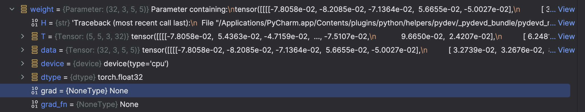

# 小土堆PyTorch

## 01 PyTorch环境的配置及安装

+ Anaconda: 包含各种package的软件

  + base环境

+ 显卡：训练加速

  + 驱动 + Cuda Toolkit

  （我跳过了GPU因为我用的是mac，只能mps）

+ 管理环境：不同的项目需要用到不同版本的的PyTorch环境，conda包能够解决这个问题，相互隔离

  

  + 用conda指令创建一个环境(其名为pytorch)：`conda create -n pytorch python=3.6`

  + To activate this environment: `conda activate pytorch`

    左边括号显示环境名：(pytorch)

  + To deactivate an active envoronment: `conda deactivate`

  + pip list: 列出package，无pytorch，所以要安装PyTorch

+ 安装PyTorch：直接去官网复制命令行输入


## 02 Python编辑器的选择安装及配置(Pycharm, Jupyter安装)

+ Pycharm CE

  + create new project: 我重新在anaconda里面创建了名叫一个pytorch的环境并安装了PyTorch，选择interpreter的时候和视频版本不同不能直接选择pytorch，所以先选了base conda，然后在里面add interpreter中试图加上existing的pytorch，但是无法使用pytorch这个环境，所以我暂时直接用base，因为我的电脑默认conda是miniconda，所以相对来说不是那么方便创建新环境，这个问题先放下。

  + 第二天我把pytorch换了一个名字，但是还是不行。。。先放着这个问题

  + 我重新新建project可以在custom environment里面选，但是好像进入了miniconda，所以我怀疑还是因为同时下载了miniconda和anaconda

  + 我决定卸载miniconda

  + 终于解决了，在system interpreter里面！！！看印度老哥的视频

  + 并没有。。。

    

  + 暂时看来是解决了，直接在create project的时候选择custom environment并且不是conda是python，在envs的pytorch的bin里找到python3.11，就可以用啦

  + 在python console里面尝试`import torch`和`torch.backends.mps.is_built()`

+ Jupyter

我发现Pycharm CE没有Jupyter Notebook

## torch.cuda.is_available()

略过，因为mac无法装cuda

## 03 Python学习中的两大法宝函数

+ package(PyTorch) 类似于工具箱
  + 不同分隔区，不同分隔区有不同工具，有的里面有更小的工具箱，有的里面直接就是工具
  + dir(): 打开看见
  + help(): 说明书
  
+ 
  
  
  
  + dir(pytorch)
  
    1, 2, 3, 4
  
    dir(pytorch.3)
  
    a, b, c
  
    help(pytorch.3.a)
  
    将此扳手放在特定地方，然后拧动
  
+ 实战：command+F可以搜索

  + dir(torch.cuda.is_available)里面分隔区前后有双下划线，变量不允许篡改，is_available不只是一个分隔区而是一个函数了

  + help(torch.cuda.is_available): available后面的()去掉------需要用到help被抢劫东西丢了------不用()

    Help on function is_available in module torch.cuda:

    Returns a bool indicating if CUDA is currently available


## 04 PyCharm及Jupyter使用及对比

+ Pycharm
  + create project 选择相应Python Interpreter
  + create .py file, 配置python interpreter（似乎已经配置好了）
  + 直接在python console里code
+ Jupyter
  + conda activate pytorch
  + jupyter notebook
+ 三种代码编辑方式对比
  + python文件：块是一个整体
    + pros：通用，传播方便，适合大型项目
    + cons：需要从头运行
  + python console：以每一行（任意行shift+回车）为一块，出现错误按⬆️进行修改
    + pros：显示每个变量属性（右侧）
    + cons：不利于代码阅读及修改
  + Jupyter
    + pros：利于代码阅读及修改
    + cons：环境需要配置


## 05 PyTorch加载数据初认识

+ Dataset: 

  + 提供一种方式获取数据及其label
    + 如何获取每一个数据及其label
    + 总共有多少的数据

+ Dataloader: 

  + 为后面的网络提供不同的数据形式

+ 如何使用Dataset

  + 数据集：train + val，train里面ants + bees，常用组织形式：

    + 文件夹名称对应label

    + 训练图片一个文件夹，labels一个文件夹里面是对应txt文件

    + 图片名称作为label

  + 使用

    + `from torch.utils.data import dataset`
    + 在Jupyter中利用`help(dataset)`和`Dataset??`查看用法

（我打算不用Pycharm ce直接用pro写.py和.ipynb，而且我发现可以直接用conda创建的pytorch环境了！）


## 06 Dataset类代码实战

+ 图片：input

  + 如何获取图片？提供这个图片的地址

    在console中:

    ```python
    from PIL import Image
    img_path = 'dataset/train/ants/0013035.jpg'
    img = Image.open(img_path) #在右侧可以看到这个img的各种属性
    img.show()
    ```

    所以我们先获取包含地址的列表，再通过索引可以得到：`import os`

    ```python
    dir_path = "ants"
    import os
    img_path_list = os.listdir("dataset/train/ants")
    img_path_list[0]
    '957233405_25c1d1187b.jpg' #与视频顺序不同：当你使用os.listdir函数列出目录内容时，返回的列表中的顺序并不保证与文件系统中显示的顺序相同，也不保证是按照文件名的字典序排列。实际上，os.listdir返回的列表顺序是依赖于文件系统底层的目录读取顺序，这可能因操作系统、文件系统类型以及目录中文件和子目录的创建和修改方式而异。例如，在某些文件系统中，文件可能按照它们在目录中的物理存储位置或创建时间的顺序被列出，这并不一定与文件名的字母顺序或任何其他逻辑顺序相对应。因此，如果你需要列表以特定顺序（如按名称排序）返回，你应该在获取列表之后手动对其进行排序。
    ```

+ ants：label

```python
from torch.utils.data import Dataset
from PIL import Image
import os

class MyData(Dataset): #MyData类继承Dataset这个类
    def __init__(self, root_dir, label_dir):
        self.root_dir = root_dir
        self.label_dir = label_dir
        self.path = os.path.join(self.root_dir, self.label_dir)
        self.img_path = os.listdir(self.path)

    def __getitem__(self, idx):
        img_name = self.img_path[idx]
        img_item_path = os.path.join(self.root_dir, self.label_dir, img_name)
        img = Image.open(img_item_path)
        label = self.label_dir
        return img, label

    def __len__(self):
        return len(self.img_path)

root_dir = "dataset/train"
ants_label_dir = "ants"
bees_label_dir = "bees"
ants_dataset = MyData(root_dir, ants_label_dir)
bees_dataset = MyData(root_dir, bees_label_dir)

train_dataset = ants_dataset + bees_dataset
```

+ label和image分开，在label文件夹中会有txt文档，文档名称是image的地址，内容是其label

  ```python
  root_dir = 'dataset/train'
  target_dir = 'ants_image'
  img_path = os.listdir(os.path.join(root_dir, target_dir))
  label = target_dir.split('_')[0]
  out_dir = "_".join([label, "label"])
  for i in img_path:
      file_name = i.split('.jpg')[0]
      with open(os.path.join(root_dir, out_dir,"{}.txt".format(file_name)),'w') as f: # 路径 + write模式
          f.write(label)
  ```


## 07 TensorBoard的使用

+ .add_scalar

  ```python
  from torch.utils.tensorboard import SummaryWriter
  
  writer = SummaryWriter("logs")
  
  # writer.add_image()
  for i in range(100):
      writer.add_scalar("y = x", (scalar_value)i, (global_value)i)
  
  writer.close()
  ```

  ```python
  tensorboard --logdir=logs #logdir=事件文件所在文件夹名
  ```

  + y轴：scalar_value
  + x轴：global_value
  + 改变的时候记得改tag！
    + 没改解决办法：把logs里面的events都删了重写

+ .add_image()

  需要用torch.Tensor, numpy.ndarray, or string/blobname类型的

  ```python
  from torch.utils.tensorboard import SummaryWriter
  import numpy as np
  from PIL import Image
  
  writer = SummaryWriter("logs")
  image_path  = "data/train/ants_image/0013035.jpg"
  img_PIL = Image.open(image_path)
  img_array = np.array(img_PIL)
  writer.add_image("test", img_array, 1, dataformats='HWC')
  
  writer.close()
  ```


## 08 Transforms的使用

+ transfroms的结构及用法

  + transforms.py 工具箱

    + 各种工具（class）：

      + totensor
      + resize

    + 图片 -> 工具 -> 结果

      

  + 1. 如何使用
    2. 为什么需要tensor数据类型：包装了神经网络所需的理论基础的参数

    有了opencv之后：
    
    ```python
    import cv2
    cv_img = cv2.imread(img_path) # numpy.array类型
    ```
    
    

## 09 常见的Transforms

+ 输入，输出，作用

  + PIL: Image.open()
  + tensor: ToTensor()
  + narrays: cv.imread()

+ ToTensor

+ Normalize

  ```python
  output[channel] = (input[channel] - mean[channel]) / std[channel]
  ```

  [0, 1] -> (mean: 0.5; std: 0.5)[-1, 1]

+ Resize

+ Compose

+ RandomCrop

+ 总结：

  + 关注输入和输出类型
  + 多看官方文档，关注方法需要什么参数
  + 不知道返回值的时候： 
    + print
    + print(type())
    + debug


## 10 torchvision中的数据集使用

```python
import torchvision
from torch.utils.tensorboard import SummaryWriter

dataset_transform = torchvision.transforms.Compose([
    torchvision.transforms.ToTensor()
])
# train_set和test_set指向同一个数据集，但是根据名字的指示会从中选择相应的部分
train_set = torchvision.datasets.CIFAR10(root='./dataset', train=True, transform=dataset_transform, download=True) # root就是文件应该放什么位置
test_set = torchvision.datasets.CIFAR10(root='./dataset', train=False, transform=dataset_transform, download=True)

writer = SummaryWriter('p10')
for i in range(10):
    img, target = test_set[i] # test_set是torchvision.datasets.CIFAR10类的一个实例，根据文档看getitem
    writer.add_image('test_set', img, i)

writer.close()
```


## 11 Dataloader的使用


```python
import torchvision
from torch.utils.data import DataLoader
from torch.utils.tensorboard import SummaryWriter

test_data = torchvision.datasets.CIFAR10(root='./dataset', train=False, transform=torchvision.transforms.ToTensor(), download=True)

test_loader = DataLoader(dataset=test_data, batch_size=10, shuffle=True, num_workers=0, drop_last=False) # num_workers=0单进程加载数据

# 测试数据集中第一张图片及target
img, target = test_data[0]
print(img.shape)
print(target) # 输出为3，因为target不是标签，是存放标签的位置，标签列表是classes，真正的标签是test_data.classes[target]

writer = SummaryWriter("dataloader")
for epoch in range(2):
    step = 0
    for data in test_loader:
        imgs, targets = data
        # print(imgs.shape)
        # print(targets)
        writer.add_images("Epoch: {}".format(epoch), imgs, step)
        step += 1

writer.close()
```


## 12 神经网络的基本骨架----nn.Module的使用

```python
import torch
from torch import nn


class GST(nn.Module):
    def __init__(self):
        super().__init__()

    def forward(self, input): # 前向传播：给一个输入，经过forward，最后进行输出
        output = input + 1
        return output


gst = GST()
x = torch.tensor(1.0)
output = gst(x) # 使用nn模型的时候会调用__call__()方法，call()里又调用了forward()方法
print(output)
```


## 13 卷积操作

+ torch.nn是对fuction的封装，封装好齿轮，方向盘的作用

  torch.nn.functional使用比较麻烦，齿轮的运转

+ 

  

+ 

  ```python
  import torch
  import torch.nn.functional as F
  
  input = torch.tensor([[1, 2, 0, 3, 1],
                        [0, 1, 2, 3, 1],
                        [1, 2, 1, 0, 0],
                        [5, 2, 3, 1, 1],
                        [2, 1, 0, 1, 1]])
  kernel = torch.tensor([[1, 2, 1],
                         [0, 1, 0],
                         [2, 1, 0]])
  
  input = torch.reshape(input, (1, 1, 5, 5)) # shape: batch_size, channel数量, height高, weight宽
  kernel = torch.reshape(kernel, (1, 1, 3, 3))
  
  print(input.shape)
  print(kernel.shape)
  
  output = F.conv2d(input, kernel, stride=1)
  print(output)
  ```

+ Padding: 填充

  ```python
  output1 = F.conv2d(input, kernel, stride=1, padding=1)
  ```


## 14 神经网络——卷积层

+ Class torch.nn.Conv2d(*in_channels*, *out_channels*, *kernel_size*, *stride=1*, *padding=0*, *dilation=1*, *groups=1*, *bias=True*, *padding_mode='zeros'*, *device=None*, *dtype=None*)

  区别于上一节的functional，大概是直接用作函数出结果了

+ in_channel(s): 一层，就是1

  out_channel(s): 例如，如果in_channel为1，那么一个卷积核，out_channel=1; 两个卷积核，out_channel=2, 两个卷积结果，叠加起来

+ 2

  ```python
  import torch
  import torchvision
  from torch import nn
  from torch.utils.data import DataLoader
  from torch.utils.tensorboard import SummaryWriter
  
  test_set = torchvision.datasets.CIFAR10(root='../dataset', train=False, transform=torchvision.transforms.ToTensor(),
                                          download=False)  # 已下载好的重新访问
  dataloader = DataLoader(test_set, batch_size=64)
  
  class GST(nn.Module):
      def __init__(self):
          super(GST, self).__init__()
          self.conv1 = nn.Conv2d(3, 6, kernel_size=3, stride=1, padding=0)
  
      def forward(self, x):
          x = self.conv1(x)
          return x
  
  gst = GST()
  
  writer = SummaryWriter('../logs')
  step = 0
  for data in dataloader:
      imgs, targets = data
      output = gst(imgs)
      print(imgs.shape)
      print(output.shape)
      writer.add_images("input", imgs, step)
      # torch.Size([64, 6, 30, 30]) 6个channel无法显示, 只能3个
      output = torch.reshape(output, ([-1, 3, 30, 30]))
      writer.add_images("output", output, step)
      step += 1
      
  writer.close()
  ```


## 15 神经网络——最大池化的使用

+ nn.MaxPool：最大池化，也称为下采样；nn.MaxUnPool：称为上采样

+ kernel_size：生成池化核

  stride：默认值为kernelsize的大小

  ceil_model：bool型，true为向上取整。默认情况下为false。如果池化核移动出了输入图像的范围，且

  ceil_model的值为true，则保留范围外的数。

  

+ 

  ```python
  import torch
  from torch import nn
  
  input = torch.tensor([[1, 2, 0, 3, 1],
                        [0, 1, 2, 3, 1],
                        [1, 2, 1, 0, 0],
                        [5, 2, 3, 1, 1],
                        [2, 1, 0, 1, 1]], dtype=torch.float32)
  
  input = torch.reshape(input, (-1, 1, 5, 5))
  print(input.shape)
  
  class GST(nn.Module):
      def __init__(self):
          super(GST, self).__init__()
          self.maxpool1 = nn.MaxPool2d(kernel_size=3, ceil_mode=False)
  
      def forward(self, input):
          output = self.maxpool1(input)
          return output
  
  gst = GST()
  output = gst(input)
  print(output)
  ```

+ 最大池化的目的：保留输入的特征，同时减小数据量，5*5的图像变成3x3，或者1的，减小数据量，参数减

  少，计算变快。

+ 对图片的处理效果

  ```python
  import torchvision
  from torch import nn
  from torch.utils.data import DataLoader
  from torch.utils.tensorboard import SummaryWriter
  
  dataset = torchvision.datasets.CIFAR10(root='../dataset', train=False, download=False,
                                         transform=torchvision.transforms.ToTensor())
  dataloader = DataLoader(dataset, batch_size=64)
  
  class GST(nn.Module):
      def __init__(self):
          super(GST, self).__init__()
          self.maxpool1 = nn.MaxPool2d(kernel_size=3, ceil_mode=False)
  
      def forward(self, input):
          output = self.maxpool1(input)
          return output
  
  gst = GST()
  writer = SummaryWriter('../logs_maxpool')
  step = 0
  for data in dataloader:
      imgs, targets = data
      writer.add_images("input", imgs, step) # !!!注意是images, 有个s
      output = gst(imgs)
      writer.add_images("output", output, step)
      step += 1
  
  writer.close()
  ```

  

## 16 神经网络——非线性激活

+ Relu, Sigmoid

+ 

  ```python
  import torch
  from torch import nn
  from torch.nn import ReLU
  
  input = torch.tensor([[1, -.5],
                        [-1, 3]])
  
  output = torch.reshape(input, (-1, 1, 2, 2))
  print(output.shape)
  
  class GST(nn.Module):
      def __init__(self):
          super(GST, self).__init__()
          self.relu1 = ReLU()  # 默认inplace=False, 保留原始数据防止丢失
      def forward(self, input):
          output = self.relu1(input)
          return output
  
  gst = GST()
  output = gst(input)
  print(output)
  ```

+ relu对图片的处理效果不是很明显，用的sigmoid

  ```python
  import torchvision
  from torch import nn
  from torch.nn import ReLU, Sigmoid
  from torch.utils.data import DataLoader
  from torch.utils.tensorboard import SummaryWriter
  
  
  dataset = torchvision.datasets.CIFAR10(root='../dataset', download=False, train=False,
                                         transform=torchvision.transforms.ToTensor())
  dataloader = DataLoader(dataset, batch_size=64)
  class GST(nn.Module):
      def __init__(self):
          super(GST, self).__init__()
          self.sigmoid1 = Sigmoid()
  
      def forward(self, input):
          output = self.sigmoid1(input)
          return output
  
  gst = GST()
  
  writer = SummaryWriter("../logs_relu")
  step = 0
  for data in dataloader:
      imgs, targets = data
      writer.add_images('input', imgs, global_step=step)
      output = gst(imgs)
      writer.add_images('output', output, global_step=step)
      step += 1
  
  writer.close()
  ```

  

## 17 神经网络——线性层及其他层介绍

+ 正则化层：对输入进行正则化，加快神经网络训练速度,num_features

  Recurrent层：用于文字识别

  Transformer层、Sparse层：做nlp可以关注一下

+ Linear线性层：

  + in_features: x_1 - x_d的个数: d
  + out_features：g_1 - g_L的个数: L
  + bias: bool型，值为true +b，false 不加
  + 神经网络通过调整k和b的值，来更好的进行预测。
  + 参数weight：就是k 参数bias：就是b

  

+ 1

  ```python
  import torch
  import torchvision
  from torch import nn
  from torch.nn import Linear
  from torch.utils.data import DataLoader
  
  dataset = torchvision.datasets.CIFAR10(root='../dataset', download=False, train=False,
                                         transform=torchvision.transforms.ToTensor())
  dataloader = DataLoader(dataset, batch_size=64, drop_last=True)
  
  class GST(nn.Module):
      def __init__(self):
          super(GST, self).__init__()
          self.linear1 = Linear(196608, 10)
  
      def forward(self, input):
          output = self.linear1(input)
          return output
  
  gst = GST()
  for data in dataloader:
      imgs, targets = data
      print(imgs.shape)
      output = torch.reshape(imgs, (1, 1, 1, -1)) ----> output = torch.flatten(imgs)
      print(output.shape)
      output = gst(output)
      print(output.shape)
  ```
  


## 18 神经网络——搭建小实战和Sequential的使用

+ CIFAR 10 model structure

  

+ 第一种

  ```python
  from torch import nn
  from torch.nn import Conv2d, MaxPool2d, Flatten, Linear
  
  
  class GST(nn.Module):
      def __init__(self):
          super(GST, self).__init__()
          self.conv1 = Conv2d(3, 32, 5, padding=2) # 根据公示算padding, dilation默认为1
          self.maxpool1 = MaxPool2d(2)
          self.conv2 = Conv2d(32, 32, 5, padding=2)
          self.maxpool2 = MaxPool2d(2)
          self.conv3 = Conv2d(32, 64, 5, padding=2)
          self.maxpool3 = MaxPool2d(2)
          self.flatten = Flatten()
          self.linear1 = Linear(1024, 64)
          self.linear2 = Linear(64, 10)
  
      def forward(self, x):
          x = self.conv1(x)
          x = self.maxpool1(x)
          x = self.conv2(x)
          x = self.maxpool2(x)
          x = self.conv3(x)
          x = self.maxpool3(x)
          x = self.flatten(x)
          x = self.linear1(x)
          x = self.linear2(x)
  
          return x
  
  gst = GST()
  print(gst)
  ```

+ 第二种，sequential

  ```python
  import torch
  from torch import nn
  from torch.nn import Conv2d, MaxPool2d, Flatten, Linear, Sequential
  
  
  class GST(nn.Module):
      def __init__(self):
          super(GST, self).__init__()
          self.model1 = Sequential(
              Conv2d(3, 32, 5, padding=2),
              MaxPool2d(2),
              Conv2d(32, 32, 5, padding=2),
              MaxPool2d(2),
              Conv2d(32, 64, 5, padding=2),
              MaxPool2d(2),
              Flatten(),
              Linear(1024, 64),
              Linear(64, 10)
          )
  
      def forward(self, x):
          x = self.model1(x)
          return x
  
  gst = GST()
  print(gst)
  input = torch.ones(64, 3, 32, 32 # batch_size = 64, 3 channels, 32*32
  output = gst(input)
  print(output.shape)
  ```


## 19 损失函数与反向传播

+ Loss Functions

  衡量损失误差，损失越小越好

  1. 计算实际输出和目标之间的差距
  2. 为我们更新输出提供一定的依据（反向传播），grad

  + L1Loss

    ```python
    import torch
    from torch.nn import L1Loss
    
    inputs = torch.tensor([1, 2, 3], dtype=torch.float32)
    targets = torch.tensor([1, 2, 5], dtype=torch.float32)
    
    inputs = torch.reshape(inputs, (1, 1, 1, 3))
    targets = torch.reshape(targets, (1, 1, 1, 3))
    
    loss = L1Loss()
    result = loss(inputs, targets)
    
    print(result) # tensor(0.6667)
    ```

  + MSELoss

    ```python
    loss_mse = MSELoss()
    result_mse = loss_mse(inputs, targets)
    print(result_mse) # tensor(1.3333)
    ```

  + CrossEntropyLoss: 训练分类问题，有c个类别

    这里的log是ln哦

    

    ```python
    x = torch.tensor([0.1, 0.2, 0.3])
    y = torch.tensor([1])
    x = torch.reshape(x, (1,3))  # batch_size = 1, 有3类
    loss_cross = CrossEntropyLoss()
    result_cross = loss_cross(x, y)
    print(result_cross) # tensor(1.1019)
    ```

+ 反向传播: 得到每个要更新参数对应的梯度

  ```python
  import torchvision
  from torch import nn
  from torch.nn import Conv2d, MaxPool2d, Flatten, Linear, Sequential
  from torch.utils.data import DataLoader
  
  dataset = torchvision.datasets.CIFAR10(root='../dataset', download=False, train=False,
                                         transform=torchvision.transforms.ToTensor())
  dataloader = DataLoader(dataset, batch_size=64, drop_last=True)
  
  class GST(nn.Module):
      def __init__(self):
          super(GST, self).__init__()
          self.model1 = Sequential(
              Conv2d(3, 32, 5, padding=2),
              MaxPool2d(2),
              Conv2d(32, 32, 5, padding=2),
              MaxPool2d(2),
              Conv2d(32, 64, 5, padding=2),
              MaxPool2d(2),
              Flatten(),
              Linear(1024, 64),
              Linear(64, 10)
          )
  
      def forward(self, x):
          x = self.model1(x)
          return x
  
  
  gst = GST()
  loss = nn.CrossEntropyLoss()
  for data in dataloader:
      imgs, targets = data
      outputs = gst(imgs)
      result_loss = loss(outputs, targets) # 写一下我自己的理解：输出的1*10 array是每个类别的概率，然后batch_size就是dataloader里面规定的
      result_loss.backward() # debug的时候记得梯度grad在weight下
      print(result_loss)
  ```

  之后会选择合适的优化器，根据梯度对神经网络当中的参数进行更新，降低loss


## 20 优化器

+ constructing example

  ```python
  optimizer = optim.SGD(model.parameters(), lr=0.01, momentum=0.9)
  optimizer = optim.Adam([var1, var2], lr=0.0001)
  ```

+ taking an optimization step

  ```python
  for input, target in dataset:
      optimizer.zero_grad() #对上一次计算出的梯度进行清0
      output = model(input) #经过模型得到输出
      loss = loss_fn(output, target) #根据输出和目标，得出误差
      loss.backward() #根据反向传播,得到每个要更新参数对应的梯度
      optimizer.step() #每一个参数，根据上一步的到的梯度，进行优化
  ```

+ 代码

  ```python
  import torch
  import torchvision
  from torch import nn
  from torch.nn import Conv2d, MaxPool2d, Flatten, Linear, Sequential
  from torch.utils.data import DataLoader
  
  dataset = torchvision.datasets.CIFAR10(root='../dataset', download=False, train=False,
                                         transform=torchvision.transforms.ToTensor())
  dataloader = DataLoader(dataset, batch_size=64, drop_last=True)
  
  class GST(nn.Module):
      def __init__(self):
          super(GST, self).__init__()
          self.model1 = Sequential(
              Conv2d(3, 32, 5, padding=2),
              MaxPool2d(2),
              Conv2d(32, 32, 5, padding=2),
              MaxPool2d(2),
              Conv2d(32, 64, 5, padding=2),
              MaxPool2d(2),
              Flatten(),
              Linear(1024, 64),
              Linear(64, 10)
          )
  
      def forward(self, x):
          x = self.model1(x)
          return x
  
  
  gst = GST()
  loss = nn.CrossEntropyLoss()
  optim = torch.optim.SGD(gst.parameters(), lr=0.01)
  for data in dataloader:
      imgs, targets = data
      outputs = gst(imgs)
      result_loss = loss(outputs, targets)
      optim.zero_grad()
      result_loss.backward()
      optim.step()
  ```

+ Debug 最后三行打断点

  1. gst --> module1 --> protected attributes --> _modules --> '0' --> weight: 可以看到grad=None

     

  2. 点击resume program --> 再次点击resume program: 计算出了对应的梯度

     

  3. 运行到最后一行后，会根据上一步的梯度进行更新

     

+ epoch

  ```python
  for epoch in range(20):
      running_loss = 0.0
      for data in dataloader:
          imgs, targets = data
          outputs = gst(imgs)
          result_loss = loss(outputs, targets)
          optim.zero_grad()
          result_loss.backward()
          optim.step()
          print(result_loss)
          running_loss += result_loss
      print(running_loss)
  ```

  结果随便截了几个：

  


## 21 现有网络模型的使用和修改

+ 分类模型VGG-16|19最常用

  ```python
  torchvision.models.vgg16(*, weights: Optional[VGG16_Weights] = None, progress: bool = True, **kwargs: Any) → VGG
  ```

  (我的是新版torch 0.17，没有progress这个parameter)

  Parameters:

  - **weights** The pretrained weights to use. By default, no pre-trained weights are used.
  - **progress** ([*bool*](https://docs.python.org/3/library/functions.html#bool)*,* *optional*) – If True, displays a progress bar of the download to stderr. Default is True.
  - **kwargs** – parameters passed to the `torchvision.models.vgg.VGG` base class.

+ 下载数据集ImageNet

  ```python
  CLASS torchvision.datasets.ImageNet(root: str, split: str = 'train', **kwargs: Any)
  ```

  Parameters:

  - **root** (*string*) – Root directory of the ImageNet Dataset.
  - **split** (*string,* *optional*) – The dataset split, supports `train`, or `val`.
  - **transform** (*callable,* *optional*) – A function/transform that takes in an PIL image and returns a transformed version. E.g, `transforms.RandomCrop`
  - **target_transform** (*callable,* *optional*) – A function/transform that takes in the target and transforms it.
  - **loader** – A function to load an image given its path.

+ pretrained

  ```python
  vgg16_false = torchvision.models.vgg16(weights=None)  # 老版：pretrained=false
  vgg16_true = torchvision.models.vgg16(weights='DEFAULT')
  ```

  pretrained=False(classifier --> protected attributes --> _modules --> '0' --> weight)

  

  pretrained=True

  

  `print(vgg16_true)`

  ```python
  VGG(
    (features): Sequential(
      (0): Conv2d(3, 64, kernel_size=(3, 3), stride=(1, 1), padding=(1, 1))
      (1): ReLU(inplace=True)
      (2): Conv2d(64, 64, kernel_size=(3, 3), stride=(1, 1), padding=(1, 1))
      (3): ReLU(inplace=True)
      (4): MaxPool2d(kernel_size=2, stride=2, padding=0, dilation=1, ceil_mode=False)
      (5): Conv2d(64, 128, kernel_size=(3, 3), stride=(1, 1), padding=(1, 1))
      (6): ReLU(inplace=True)
      (7): Conv2d(128, 128, kernel_size=(3, 3), stride=(1, 1), padding=(1, 1))
      (8): ReLU(inplace=True)
      (9): MaxPool2d(kernel_size=2, stride=2, padding=0, dilation=1, ceil_mode=False)
      (10): Conv2d(128, 256, kernel_size=(3, 3), stride=(1, 1), padding=(1, 1))
      (11): ReLU(inplace=True)
      (12): Conv2d(256, 256, kernel_size=(3, 3), stride=(1, 1), padding=(1, 1))
      (13): ReLU(inplace=True)
      (14): Conv2d(256, 256, kernel_size=(3, 3), stride=(1, 1), padding=(1, 1))
      (15): ReLU(inplace=True)
      (16): MaxPool2d(kernel_size=2, stride=2, padding=0, dilation=1, ceil_mode=False)
      (17): Conv2d(256, 512, kernel_size=(3, 3), stride=(1, 1), padding=(1, 1))
      (18): ReLU(inplace=True)
      (19): Conv2d(512, 512, kernel_size=(3, 3), stride=(1, 1), padding=(1, 1))
      (20): ReLU(inplace=True)
      (21): Conv2d(512, 512, kernel_size=(3, 3), stride=(1, 1), padding=(1, 1))
      (22): ReLU(inplace=True)
      (23): MaxPool2d(kernel_size=2, stride=2, padding=0, dilation=1, ceil_mode=False)
      (24): Conv2d(512, 512, kernel_size=(3, 3), stride=(1, 1), padding=(1, 1))
      (25): ReLU(inplace=True)
      (26): Conv2d(512, 512, kernel_size=(3, 3), stride=(1, 1), padding=(1, 1))
      (27): ReLU(inplace=True)
      (28): Conv2d(512, 512, kernel_size=(3, 3), stride=(1, 1), padding=(1, 1))
      (29): ReLU(inplace=True)
      (30): MaxPool2d(kernel_size=2, stride=2, padding=0, dilation=1, ceil_mode=False)
    )
    (avgpool): AdaptiveAvgPool2d(output_size=(7, 7))
    (classifier): Sequential(
      (0): Linear(in_features=25088, out_features=4096, bias=True)
      (1): ReLU(inplace=True)
      (2): Dropout(p=0.5, inplace=False)
      (3): Linear(in_features=4096, out_features=4096, bias=True)
      (4): ReLU(inplace=True)
      (5): Dropout(p=0.5, inplace=False)
      (6): Linear(in_features=4096, out_features=1000, bias=True)
    )
  )
  ```

+ 如果想在classifier里添加一层：

  ```python
  vgg16_true.classifier.add_module('add_linear', nn.Linear(1000, 10))
  ```

  ```python
  (classifier): Sequential(
      (0): Linear(in_features=25088, out_features=4096, bias=True)
      (1): ReLU(inplace=True)
      (2): Dropout(p=0.5, inplace=False)
      (3): Linear(in_features=4096, out_features=4096, bias=True)
      (4): ReLU(inplace=True)
      (5): Dropout(p=0.5, inplace=False)
      (6): Linear(in_features=4096, out_features=1000, bias=True)
      (add_linear): Linear(in_features=1000, out_features=10, bias=True)
    )
  ```

+ 修改

  ```python
  vgg16_false.classifier[6] = nn.Linear(4096, 10)
  ```


## 22 网络模型的保存与读取

+ 第一种

  ```python
  # 保存方式1 模型结构+参数
  torch.save(vgg16, "vgg16_method1.pth")
  ```

  ```python
  # 方式1 -> 保存方式1，加载模型
  model = torch.load("vgg16_method1.pth")
  print(model)
  ```

  ```python
  VGG(
    (features): Sequential(
      (0): Conv2d(3, 64, kernel_size=(3, 3), stride=(1, 1), padding=(1, 1))
      (1): ReLU(inplace=True)
      (2): Conv2d(64, 64, kernel_size=(3, 3), stride=(1, 1), padding=(1, 1))
      (3): ReLU(inplace=True)
      (4): MaxPool2d(kernel_size=2, stride=2, padding=0, dilation=1, ceil_mode=False)
      (5): Conv2d(64, 128, kernel_size=(3, 3), stride=(1, 1), padding=(1, 1))
      (6): ReLU(inplace=True)
      (7): Conv2d(128, 128, kernel_size=(3, 3), stride=(1, 1), padding=(1, 1))
      (8): ReLU(inplace=True)
      (9): MaxPool2d(kernel_size=2, stride=2, padding=0, dilation=1, ceil_mode=False)
      (10): Conv2d(128, 256, kernel_size=(3, 3), stride=(1, 1), padding=(1, 1))
      (11): ReLU(inplace=True)
      (12): Conv2d(256, 256, kernel_size=(3, 3), stride=(1, 1), padding=(1, 1))
      (13): ReLU(inplace=True)
      (14): Conv2d(256, 256, kernel_size=(3, 3), stride=(1, 1), padding=(1, 1))
      (15): ReLU(inplace=True)
      (16): MaxPool2d(kernel_size=2, stride=2, padding=0, dilation=1, ceil_mode=False)
      (17): Conv2d(256, 512, kernel_size=(3, 3), stride=(1, 1), padding=(1, 1))
      (18): ReLU(inplace=True)
      (19): Conv2d(512, 512, kernel_size=(3, 3), stride=(1, 1), padding=(1, 1))
      (20): ReLU(inplace=True)
      (21): Conv2d(512, 512, kernel_size=(3, 3), stride=(1, 1), padding=(1, 1))
      (22): ReLU(inplace=True)
      (23): MaxPool2d(kernel_size=2, stride=2, padding=0, dilation=1, ceil_mode=False)
      (24): Conv2d(512, 512, kernel_size=(3, 3), stride=(1, 1), padding=(1, 1))
      (25): ReLU(inplace=True)
      (26): Conv2d(512, 512, kernel_size=(3, 3), stride=(1, 1), padding=(1, 1))
      (27): ReLU(inplace=True)
      (28): Conv2d(512, 512, kernel_size=(3, 3), stride=(1, 1), padding=(1, 1))
      (29): ReLU(inplace=True)
      (30): MaxPool2d(kernel_size=2, stride=2, padding=0, dilation=1, ceil_mode=False)
    )
    (avgpool): AdaptiveAvgPool2d(output_size=(7, 7))
    (classifier): Sequential(
      (0): Linear(in_features=25088, out_features=4096, bias=True)
      (1): ReLU(inplace=True)
      (2): Dropout(p=0.5, inplace=False)
      (3): Linear(in_features=4096, out_features=4096, bias=True)
      (4): ReLU(inplace=True)
      (5): Dropout(p=0.5, inplace=False)
      (6): Linear(in_features=4096, out_features=1000, bias=True)
    )
  )
  ```

+ 第二种

  ```python
  # 保存方式2 模型参数(官方推荐)
  torch.save(vgg16.state_dict(), "vgg16_method2.pth")
  ```

  ```python
  # 方式2 加载模型
  model = torch.load("vgg16_method2.pth")
  print(model)
  ```

  ```python
  /Users/shaygong/anaconda3/envs/pytorch/bin/python /Users/shaygong/Desktop/CS/ML/TuDuiPyTorch/learn_PyTorch/scr/19model_load.py 
  OrderedDict([('features.0.weight', tensor([[[[ 5.6825e-02,  4.9013e-04, -2.7460e-02],
            [-2.4227e-02,  4.4598e-02,  6.6402e-02],
            [ 5.9091e-02,  2.4352e-02, -6.1542e-02]],
  
           [[-1.5032e-01, -2.6745e-02,  1.5898e-02],
            [-4.7329e-02,  6.1646e-02, -3.0177e-02],
            [ 3.1546e-02, -7.7197e-03, -3.6234e-03]],
  剩下的太多了省略了                                     
  ```

  所以应该：

  ```python
  # 方式2 加载模型
  vgg16 = torchvision.models.vgg16(weights=None)
  vgg16.load_state_dict(torch.load("vgg16_method2.pth"))
  print(vgg16)
  ```

+ 陷阱

  ```python
  # 陷阱
  class GST(nn.Module):
      def __init__(self):
          super().__init__()
          self.conv1 = nn.Conv2d(3, 64, kernel_size=3)
  
      def forward(self, x):
          x = self.conv1(x)
          return x
  
  gst = GST()
  torch.save(gst, "gst_method1.pth")
  ```

  ```python
  # 陷阱
  model = torch.load("gst_method1.pth") 会报错
  还是得：
  class GST(nn.Module):
      def __init__(self):
          super().__init__()
          self.conv1 = nn.Conv2d(3, 64, kernel_size=3)
  
      def forward(self, x):
          x = self.conv1(x)
          return x
  model = torch.load("gst_method1.pth")
  只是省略了gst = GST()
  ```

  真实写代码：

  ```python
  #from 18model_save(不能以数字开头) import *
  from test18_model_save import *
  ```


## 23 完整的模型训练套路

+ 关于.item()

  ```python
  import torch
  a = torch.tensor(5)
  print(a)  # tensor(5)
  print(a.item())  # 5
  ```

+ train.py

  ```python
  import torchvision
  from torch import nn
  from torch.utils.data import DataLoader
  from torch.utils.tensorboard import SummaryWriter
  
  from test19_model import *
  
  # 准备数据集
  train_data = torchvision.datasets.CIFAR10(root='../dataset', train=True, transform=torchvision.transforms.ToTensor(),
                                            download=True)
  test_data = torchvision.datasets.CIFAR10(root='../dataset', train=False, transform=torchvision.transforms.ToTensor(),
                                           download=True)
  
  # length 长度
  train_data_size = len(train_data)
  test_data_size = len(test_data)
  # 如果train_data_size=10, 训练数据集的长度为10
  print("Train data size: {}".format(train_data_size))
  print("Test data size: {}".format(test_data_size))
  
  # 利用DataLoader来加载数据集
  train_dataloader = DataLoader(train_data, batch_size=64)
  test_dataLoader = DataLoader(test_data, batch_size=64)
  
  # 创建网络模型
  gst = GST()
  
  # 损失函数
  loss_fn = nn.CrossEntropyLoss()
  
  # 优化器
  learning_rate = 1e-2
  optimizer = torch.optim.SGD(gst.parameters(), lr=learning_rate)
  
  # 设置训练网络的一些参数
  # 记录训练的次数
  total_train_step = 0
  # 记录测试的次数
  total_test_step = 0
  # 训练的轮数
  epoch = 10
  
  # 添加tensorboard
  writer = SummaryWriter("../logs_train")
  
  for i in range(epoch):
      print("-------- 第 {} 轮训练开始 --------".format(i+1))
  
      # 训练步骤开始
      for data in train_dataloader:
          imgs, targets = data
          outputs = gst(imgs)
          loss = loss_fn(outputs, targets)
          # 优化器优化模型
          optimizer.zero_grad()
          loss.backward()
          optimizer.step()
  
          total_train_step += 1
          if total_train_step % 100 == 0:
              print("训练次数: {}, Loss: {}".format(total_train_step, loss.item()))
              writer.add_scalar("train_loss", loss.item(), total_train_step)
  
      # 测试步骤开始
      total_test_loss = 0
      with torch.no_grad():
          for data in test_dataLoader:
              imgs, targets = data
              outputs = gst(imgs)
              loss = loss_fn(outputs, targets)
              total_test_loss += loss.item()
      print("Total Test loss: {}".format(total_test_loss))
      writer.add_scalar("test_loss", total_test_loss, total_test_loss, total_test_step)
      total_test_step += 1
  
      torch.save(gst, "gst_{}.pth".format(i))
  
  writer.close()
  ```

+ model.py

  ```python
  import torch
  from torch import nn
  
  class GST(nn.Module):
      def __init__(self):
          super().__init__()
          self.model = nn.Sequential(
              nn.Conv2d(3, 32, 5, 1, 2),
              nn.MaxPool2d(2),
              nn.Conv2d(32, 32, 5, 1, 2),
              nn.MaxPool2d(2),
              nn.Conv2d(32, 64, 5, 1, 2),
              nn.MaxPool2d(2),
              nn.Flatten(),
              nn.Linear(64 * 4 * 4, 64),
              nn.Linear(64, 10)
          )
  
      def forward(self, x):
          x = self.model(x)
          return x
  
  
  if __name__ == '__main__':  # 下面的代码只有在这个脚本被直接运行时才会执行
      gst = GST()
      input = torch.ones(64, 3, 32, 32)
      output = gst(input)
      print(output.shape)
  ```

+ 准确率问题

  ```python
  2 * input
  
  Model(2分类)
  
  outputs = 
  [0.1, 0.2]
  [0.3, 0.4]
  
    0    1
  
  Argmax # 从outputs转化到preds
  
  preds = [1]
  				[1]
  input targets = [0][1]
  
  preds == input targets
  
  [false, true].sum() = 1
  ```

  ```python
  import torch
  outputs = torch.tensor([[0.1, 0.2],
                         [0.3, 0.4]])
  print(outputs.argmax(1))  # 从横向看
  
  结果：tensor([1, 1])
  
  
  import torch
  outputs = torch.tensor([[0.1, 0.2],
                         [0.05, 0.4]])
  print(outputs.argmax(0))  # 从纵向看
  结果：tensor([0, 1])
  ```
  
  ```python
  import torch
  
  outputs = torch.tensor([[0.1, 0.2],
                         [0.3, 0.4]])
  
  preds = outputs.argmax(1)
  targets = torch.tensor([0, 1])
  print(preds == targets) 结果：tensor([False,  True])
  print((preds == targets).sum()) 结果：tensor(1)
  ```
  
+ 

  ```python
  gst.train()
  gst.eval()
  ```


## 24 利用GPU训练

+ 第一种

  ```python
  网络模型
  
  数据（输入，标注）
  
  损失函数
  
  .cuda()
  ```

  ```python
  gst = GST()
  (if torch.cuda.is_available():)
  gst = gst.cuda()
  
  loss_fn = nn.CrossEntropyLoss()
  loss_fn = loss_fn.cuda()
  
  ## 其实只有数据要重新复制
  
  imgs, targets = data
  imgs = imgs.cuda()
  targets = targets.cuda()
  ```

  + google colab

+ 第二种

  ```python
  .to(device)
  
  device = torch.device("cpu")
  
  torch.device("cuda")
  ```


## 25 完整的模型验证套路

+ 完整的模型验证（测试，demo）套路：利用已经训练好的模型，然后给他提供输入

+ test

  ```python
  import torch
  import torchvision
  from PIL import Image
  from torch import nn
  
  device = torch.device("mps")
  image_path = "../img/dog.png"
  image = Image.open(image_path)
  print(image)
  image = image.convert('RGB')
  transform = torchvision.transforms.Compose([torchvision.transforms.Resize((32, 32)),
                                              torchvision.transforms.ToTensor()])
  image = transform(image)
  print(image.shape)
  
  class GST(nn.Module):
      def __init__(self):
          super().__init__()
          self.model = nn.Sequential(
              nn.Conv2d(3, 32, 5, 1, 2),
              nn.MaxPool2d(2),
              nn.Conv2d(32, 32, 5, 1, 2),
              nn.MaxPool2d(2),
              nn.Conv2d(32, 64, 5, 1, 2),
              nn.MaxPool2d(2),
              nn.Flatten(),
              nn.Linear(64 * 4 * 4, 64),
              nn.Linear(64, 10)
          )
  
      def forward(self, x):
          x = self.model(x)
          return x
  
  model = torch.load("gst_9.pth")
  print(model)
  image = torch.reshape(image, (1, 3, 32, 32)) # 记住需要batch_size
  # 或者加用cpu映射: model = torch.load("gst_9.pth", map_location=torch.device('cpu'))
  image = image.to(device)  
  model.eval()
  with torch.no_grad():
      output = model(image)
  print(output)
  
  print(output.argmax(1))  # 对了
  ```
